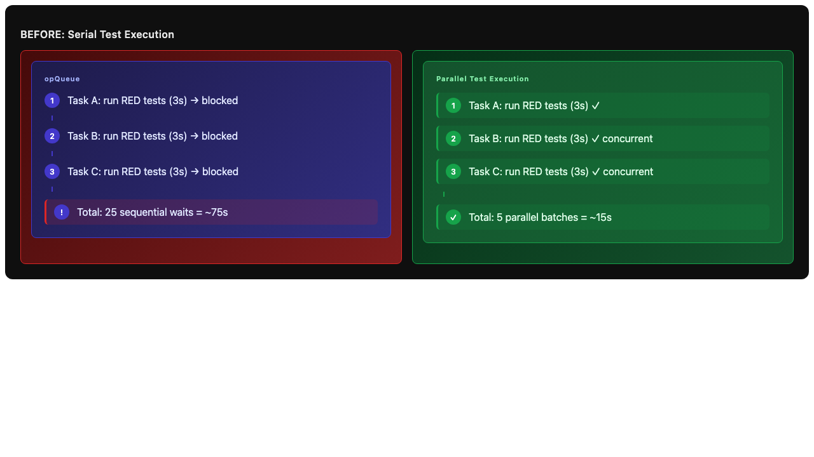
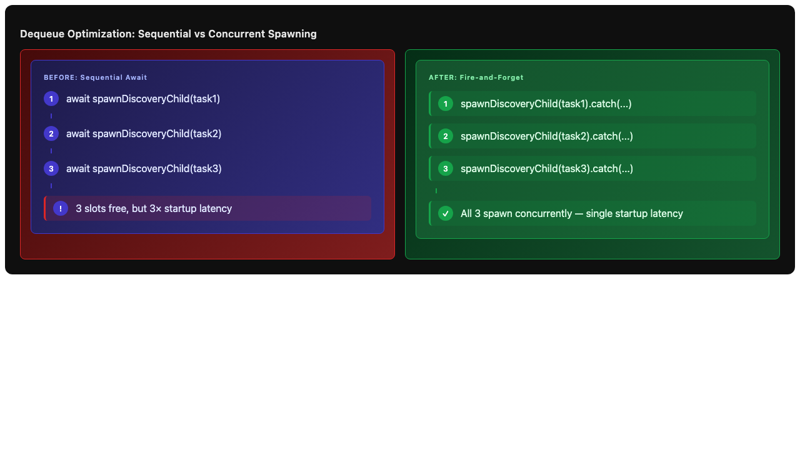

# Issue #2: Optimize DAGOrchestrator wall-clock execution time for ~10-task DAGs

## Summary

Eliminate structural serialization bottlenecks in `DAGOrchestrator` and `useDAGOrchestrator` that force concurrent-capable operations (test execution, task spawning, status computation) to run sequentially. For a 10-task DAG with `maxConcurrent=5`, these bottlenecks add ~60–75 seconds of pure wait time.

## Root Cause Analysis

The orchestrator uses a single global `opQueue` Promise chain (`this.enqueue()`) to serialize *all* async operations. While this prevents race conditions, it also blocks independent work:

1. **Test execution serializes the pipeline** — `runRedVerification` and `runGreenEvaluation` each `await` the `tdd:run-tests` IPC call inside the queue. With 10 tasks × ~2.5 test runs each ≈ 25 sequential waits at ~3s each, tests alone consume ~75s of wall-clock time even though the test runner can handle multiple concurrent invocations.

2. **Dequeue spawns one-at-a-time** — `dequeueNext()` uses `await this.spawnDiscoveryChild(nextTask)` in a `while` loop. When 3 slots free up simultaneously, tasks 2 and 3 wait for task 1's tab creation + IPC registration + message cloning to finish before they start.

3. **O(n) running count scan** — `getRunningCount()` iterates all `taskRegistry.values()` every time it's called, which happens inside `doOnTasksReady` (once per task) and `dequeueNext`.

4. **Unconditional 1s status polling** — `useDAGOrchestrator` calls `getFullStatus()` every 1000ms via `setInterval`, rebuilding the entire `OrchestratorStatus` object even when nothing changed.

5. **Generation monitor allocates on every stop** — `subscribeToGeneratingChanges` callback builds `Array.from(this.tabToTask.keys())` and a joined string for every generation-complete event in the entire app, even for non-DAG tabs.

## Proposed Solution

### 1. Move test execution outside the serial queue

Change `runRedVerification` and `runGreenEvaluation` to:
1. Enter the queue to set phase → `red_verification` / `green_evaluation`
2. **Exit the queue** to run tests async
3. Re-enter the queue to handle results with phase guards

Add a `runTestsAsync` helper:

```typescript
private async runTestsAsync(
  entry: TaskEntry,
  phase: "red_verification" | "green_evaluation",
  onResult: (result: TestRunResult) => Promise<void>,
): Promise<void> {
  const projectCwd = getProjectStoreState()?.currentProjectPath ?? undefined;
  const result: TestRunResult = await window.electronAPI!.ipcRenderer.invoke(
    "tdd:run-tests",
    entry.testScript,
    projectCwd,
  );

  // Re-enter queue to handle result atomically
  await this.enqueue(async () => {
    const current = this.taskRegistry.get(entry.taskId);
    if (!current || current.phase !== phase) return; // Stale — task moved on
    await onResult(result);
  });
}
```

The result handler must guard against stale phase (task may have been cancelled, split, or escalated while tests ran).

### 2. Fire-and-forget dequeue spawning

In `dequeueNext`, change:

```typescript
// BEFORE
await this.spawnDiscoveryChild(nextTask);

// AFTER
this.spawnDiscoveryChild(nextTask).catch((err) => {
  logger.error(LogCategory.CHAT, "[DAGOrchestrator] dequeue spawn failed:", err);
  // spawnDiscoveryChild already handles registry cleanup on failure
});
```

`spawnDiscoveryChild` already handles its own registry state and failure paths. Multiple calls are safe because each task has a unique ID and the registry deduplicates.

### 3. Cache running count incrementally

Add a private counter and update it explicitly:

```typescript
private _runningCount = 0;

private getRunningCount(): number {
  return this._runningCount;
}

private incrementRunningCount(delta: number): void {
  this._runningCount += delta;
}
```

Update sites:
- `createTaskEntry`: if phase is "active", increment
- `doOnTasksReady`: increment for each task that transitions to `discovery_in_progress`
- `dequeueNext`: increment when dequeuing to `discovery_in_progress`
- `runRedVerification` / `runGreenEvaluation`: decrement when leaving active phase, increment when entering
- Phase transition methods: adjust on every phase change to/from active states
- `getRunningCount()`: return cached value

Active phases: `discovery_in_progress`, `awaiting_generation_complete`, `red_verification`, `implementing`, `green_evaluation`, `discovery_self_review`, `revision_in_progress`.

### 4. Reduce status sync frequency

In `useDAGOrchestrator.ts`, change the sync interval from 1000ms to 3000ms:

```typescript
// BEFORE
syncIntervalRef.current = setInterval(() => { ... }, 1000);

// AFTER
syncIntervalRef.current = setInterval(() => { ... }, 3000);
```

The existing `syncTickCount` logic (immediate first save, then every 3rd tick debounced) combined with the slower interval reduces `getFullStatus()` calls from ~1/s to ~1/9s — a 9× reduction in status rebuilds.

### 5. Trim generation monitor overhead

Remove the `trackedIds` array allocation from `subscribeToGeneratingChanges` callback. The existing `tracked` boolean check is sufficient for the common case (non-DAG tabs). The detailed tab list logging can be moved to a debug-level log or removed entirely:

```typescript
// BEFORE
const tracked = this.tabToTask.has(chatId);
const trackedIds = Array.from(this.tabToTask.keys());
logger.info(LogCategory.CHAT, `[DAGOrchestrator] generationChange: chatId=${chatId} stopped generating. tracked=${tracked} trackedTabs=[${trackedIds.join(",")}]`);

// AFTER
const tracked = this.tabToTask.has(chatId);
if (tracked) {
  logger.info(LogCategory.CHAT, `[DAGOrchestrator] generationChange: chatId=${chatId} stopped generating.`);
  this.extractAndAccumulateCost(chatId);
  this.onGenerationComplete(chatId);
}
```

## Files to Modify

| File | Change |
|------|--------|
| `src/renderer/Services/AgenticLoopOrchestration/DAGOrchestrator.ts` | Add `runTestsAsync` helper; refactor `runRedVerification` and `runGreenEvaluation` to use it; make `dequeueNext` fire-and-forget; add `_runningCount` cache with explicit updates; trim generation monitor logging |
| `src/renderer/hooks/useDAGOrchestrator.ts` | Change sync interval from 1000ms to 3000ms |

## New Files

| File | Purpose |
|------|---------|
| None | All changes are in-place modifications |

## Implementation Steps

1. **Add `runTestsAsync` helper** to `DAGOrchestrator.ts`
   - Extract common test-running logic into a private method
   - Ensure it exits the queue for the IPC call and re-enters for result handling

2. **Refactor `runRedVerification`**
   - Replace inline `await window.electronAPI!.ipcRenderer.invoke("tdd:run-tests", ...)` with `runTestsAsync`
   - Move result handling into the `onResult` callback with phase guard
   - Ensure `dequeueNext()` is called from within the result handler

3. **Refactor `runGreenEvaluation`**
   - Same pattern as `runRedVerification`
   - Handle `allPassed` true/false branches in the result callback
   - Ensure `notifyTaskCompleted` and `dequeueNext` are called correctly

4. **Make `dequeueNext` concurrent**
   - Change `await this.spawnDiscoveryChild(nextTask)` to fire-and-forget with `.catch()`
   - Verify that `spawnDiscoveryChild` handles its own failures (it does — marks failed and calls `dequeueNext`)

5. **Add `_runningCount` cache**
   - Add private field, initialize to 0
   - Update at all phase transition sites
   - Replace O(n) scan in `getRunningCount()` with cached getter

6. **Slow down status sync**
   - Change interval in `useDAGOrchestrator.ts` from 1000ms to 3000ms

7. **Trim generation monitor**
   - Remove `trackedIds` array allocation and detailed logging from `subscribeToGeneratingChanges`

8. **Update tests**
   - Adjust `dagOrchestrator.test.ts` expectations for concurrent behavior
   - Add tests for stale-phase guard in test result handlers
   - Add tests for `_runningCount` cache correctness

9. **Run test suite**
   - Verify all DAG orchestrator tests pass
   - Verify no regressions in discovery/impl/GREEN/RED lifecycle

## Test Strategy

- **Unit tests**: `dagOrchestrator.test.ts`
  - Test that `runTestsAsync` correctly guards against stale phase
  - Test that multiple queued tasks spawn concurrently (mock `handleAddChat` with delays, assert overlapping calls)
  - Test that `_runningCount` stays consistent through all phase transitions
  - Test that test execution no longer blocks the opQueue (enqueue a second operation while tests "run", assert it executes before test result handler)

- **Integration tests**: None required — changes are internal to orchestrator logic

- **Edge cases**:
  - Task cancelled while tests are running → result handler must no-op (stale phase guard)
  - Task split while tests are running → result handler must no-op
  - Task escalated to human_review while tests are running → result handler must no-op
  - `dequeueNext` called while previous dequeue is still spawning → concurrent spawns must not conflict
  - `_runningCount` must never go negative (assertion in debug builds)

## Diagrams

### Serial vs Parallel Test Execution



### Dequeue Optimization



## Risks & Mitigations

| Risk | Mitigation |
|------|------------|
| Race condition: test results arrive after task moved to different phase | Phase guard in result handler — check `current.phase === expectedPhase` before acting |
| Race condition: concurrent `dequeueNext` calls spawn more than `maxConcurrent` tasks | `_runningCount` is updated atomically within `enqueue`; fire-and-forget spawns don't await, so the while loop condition is checked once per dequeue call |
| `spawnDiscoveryChild` failure not awaited → uncaught rejection | Add `.catch()` handler that logs and ensures task is marked failed |
| `_runningCount` drifts from reality due to missed update site | Add debug assertion `console.assert(_runningCount >= 0)`; add unit test that walks all phase transitions and verifies count |
| Status sync at 3s feels "laggy" in UI | 3s is still fast for background task progress; the first sync is immediate (syncTickCount === 1) |
| Removing generation monitor logging loses debugging info | Keep a single concise log line for tracked tabs; only remove the expensive `Array.from` + join |

## Expected Impact

- **Test-wait serialization**: ~25 sequential waits → ~5 parallel batches (20% of original time)
- **Dequeue latency**: 3× startup latency → 1× startup latency for dependent chains
- **Status sync overhead**: 1 rebuild/s → ~0.11 rebuild/s (9× reduction)
- **Generation monitor GC pressure**: Eliminates `O(n)` array allocation on every generation stop across the app
- **Overall wall-clock**: Estimated 20–40% reduction for 10-task DAGs with moderate test suites
