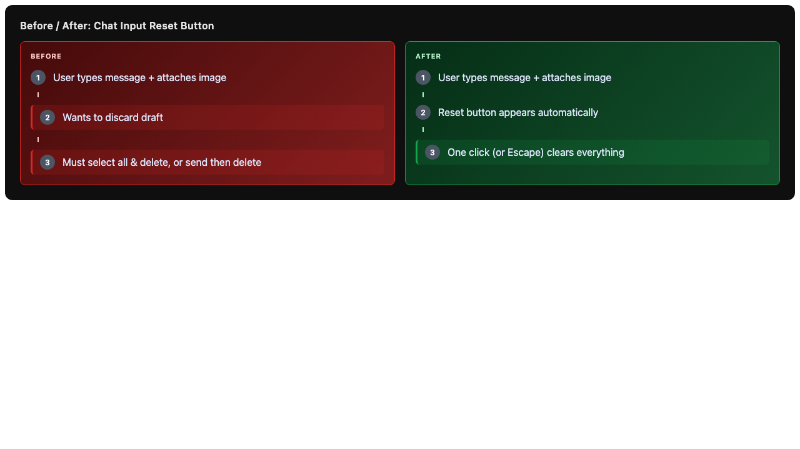
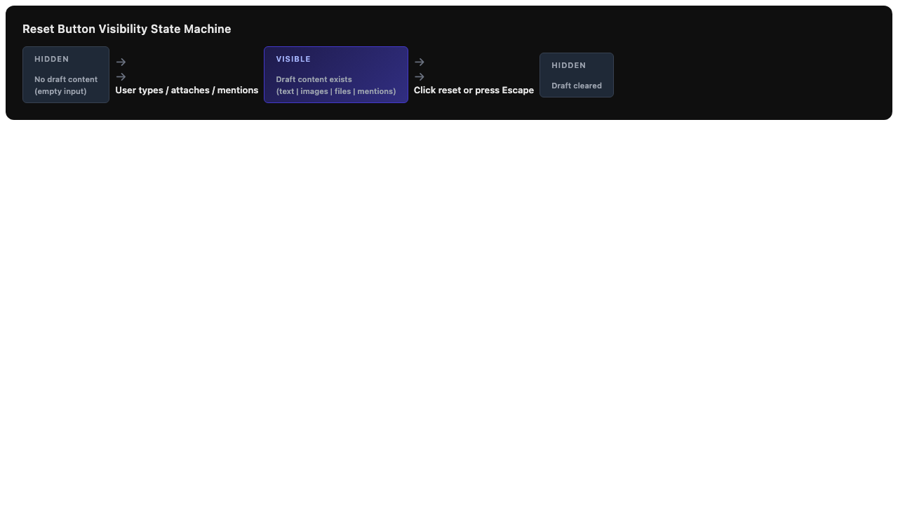
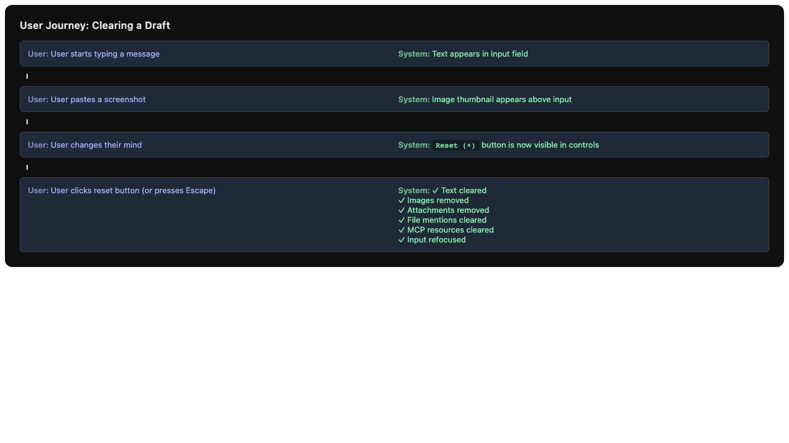

# Issue #3 – Add reset button to chat input to clear draft without sending

## Summary

Add a small reset/clear button to the chat input controls area that allows users to discard the current draft (text, images, attachments, and mentions) with a single click or via the Escape key, without sending the message.

## Root Cause Analysis

Currently, once a user starts composing a message in the chat input, the only ways to discard it are:

1. Manually select all text and delete it (does not clear images/attachments/mentions)
2. Send the message and then delete the sent message (roundabout and leaves artifacts)

The `submitPrompt()` function in `ChatInput.tsx` (around line 2055) already contains the logic for clearing all draft state, but it is tightly coupled with the send action. There is no standalone way to clear draft state without triggering a workflow. The Escape key handler (around line 2097) currently only handles cancelling queued message edits — it can be extended to also clear normal drafts when no queued message is being edited.

## Proposed Solution

Extract the draft-clearing logic from `submitPrompt()` into a reusable `clearDraft()` function. Add a conditional reset button to the chat input controls that appears only when there is draft content. Wire the Escape key to clear drafts when no queued message edit is in progress.

### UI Design (Option A — Selected)

A small circular icon button (× or reset icon) placed in the controls row, **only visible when there is draft content** (non-empty text, images, attachments, or mentions). This keeps the UI clean when the input is empty and provides one-click discovery.

| Placement | Visibility | Pros | Cons |
|-----------|-----------|------|------|
| **Option A**: Icon button, conditional | Only when content exists | Clean empty state, one-click, minimal clutter | Slight layout shift on appear/disappear |
| Option B: Always-visible icon | Always | Consistent position, no layout shift | Wasted space when empty, less clean |
| Option C: Right-click context menu | On demand | Zero chrome | Not discoverable |

**Decision**: Option A — the conditional icon button is the right balance of discoverability and cleanliness. The button will be placed between the permission toggle and the summarize button on the left controls, or near the attachment button for spatial grouping with "input manipulation" actions.

## Files to Modify

| File | Change |
|------|--------|
| `src/renderer/Components/NewChatUI/ChatInput/ChatInput.tsx` | Extract `clearDraft()` from `submitPrompt()`; add `handleClearDraft()` handler; add reset button JSX; extend Escape key handler; update `tabbableRefs` |
| `src/renderer/Components/NewChatUI/ChatInput/ChatInputStyles.tsx` | Add `ResetButton` styled component (circular icon button, 30×30px, hover red tint) |

## New Files

| File | Purpose |
|------|---------|
| `src/renderer/Components/NewChatUI/ChatInput/__tests__/ChatInput.reset.test.tsx` | Unit tests for reset button visibility, click handler, and Escape key behavior |

## Implementation Steps

### Step 1 — Extract reusable `clearDraft()` function

In `ChatInput.tsx`, extract the draft-clearing logic from the end of `submitPrompt()` (lines 2055–2068) into a standalone `clearDraft()` function:

```typescript
const clearDraft = useCallback(() => {
  if (activeChatId) {
    attachmentsBySessionRef.current.delete(activeChatId);
  }
  clearVoiceDictationOnSubmitPrompt();
  setPrompt("");
  setImages([]);
  setAttachments([]);
  setMcpResourceMentions([]);
  setFileMentionContexts([]);
  if (workflowMode !== "manual") {
    useFileBrowserStore.getState().clearSelectionAndPersist();
  }
  setUploadError(null);
  closeSlashCommandDropdown();
  closeMentionDropdown();
  inputRef.current?.focus();
}, [activeChatId, workflowMode, clearVoiceDictationOnSubmitPrompt, setPrompt, setImages, setAttachments, closeSlashCommandDropdown, closeMentionDropdown]);
```

Replace the inline clearing in `submitPrompt()` with `clearDraft()`.

### Step 2 — Add `ResetButton` styled component

In `ChatInputStyles.tsx`, add a new styled component:

```typescript
const ResetButton = styled.button.attrs({ type: "button" })`
  ${mixins.flexCenter}
  flex-shrink: 0;
  height: 30px;
  width: 30px;
  padding: 0;
  border-radius: 5px;
  background: transparent;
  color: ${themeColors.chatColors.messageBoxIcon};
  border: 1px solid transparent;
  box-sizing: border-box;
  opacity: 0.85;
  transition:
    background-color 0.2s ease-in-out,
    box-shadow 0.2s ease-in-out,
    border-color 0.2s ease-in-out,
    opacity 0.2s ease-in-out;
  cursor: pointer;

  &:hover {
    background-color: ${themeColors.unifiedUi.backgroundLightHover};
    box-shadow: ${themeShadows.buttonInset};
    border: 1px solid ${themeColors.unifiedUi.background};
    color: ${themeColors.appColors.deleteFileRed};
  }

  &:focus-visible {
    outline: 2px solid ${themeColors.appColors.mintAccent};
  }
`;
```

Export `ResetButton` from the module.

### Step 3 — Add reset button to ChatInput controls

Import `ResetButton` and `MdClear` (from `react-icons/md`) into `ChatInput.tsx`.

Add a `hasDraftContent` boolean derived from input state:

```typescript
const hasDraftContent = prompt.trim() !== "" || images.length > 0 || attachments.length > 0 || mcpResourceMentions.length > 0 || fileMentionContexts.length > 0;
```

Insert the reset button into the `LeftControlsContainer`, after the attachment button and before the workflow mode toggle (or after the workflow mode toggle — placement should be tested for visual balance). The button only renders when `hasDraftContent` is true:

```tsx
{hasDraftContent && (
  <>
    <ControlSeparator />
    <ToolTipWrapper content="Clear draft" direction="top">
      <ResetButton
        tabIndex={0}
        role="button"
        aria-label="Clear draft"
        onClick={clearDraft}
        onKeyDown={(e) => handleControlActivateKeyDown(e, clearDraft)}
      >
        <MdClear size={20} />
      </ResetButton>
    </ToolTipWrapper>
  </>
)}
```

### Step 4 — Extend Escape key handler

In `handleKeyDown`, extend the Escape handling (currently lines 2097–2121) so that when there is no queued message being edited, Escape clears the draft:

```typescript
if (e.key === "Escape") {
  const editing = useMessageQueueStore.getState()._editingMessage;
  if (editing && activeChatId) {
    // Existing queued-message edit cancellation...
    return;
  }
  // NEW: Clear draft if there is content
  if (hasDraftContent) {
    e.preventDefault();
    e.nativeEvent.stopImmediatePropagation();
    clearDraft();
    return;
  }
}
```

### Step 5 — Update `tabbableRefs`

Add the reset button ref to `tabbableRefs` when visible, so keyboard tab navigation includes it:

```typescript
const resetButtonRef = useRef<HTMLButtonElement>(null);
// ...
const tabbableRefs = useMemo((): React.RefObject<HTMLElement | null>[] => {
  const refs: React.RefObject<HTMLElement | null>[] = [
    inputRef as React.RefObject<HTMLElement | null>,
    voiceButtonRef,
    attachmentButtonRef,
  ];
  if (hasDraftContent) {
    refs.push(resetButtonRef);
  }
  refs.push(workflowModeRef);
  // ... rest unchanged
```

### Step 6 — Tests

Create `__tests__/ChatInput.reset.test.tsx` with tests covering:

1. **Button visibility**: Button is not rendered when input is empty; button is rendered when text/images/attachments/mentions exist.
2. **Click handler**: Clicking the button calls `clearDraft`, which clears text, images, attachments, mentions, and focuses the input.
3. **Escape key**: Pressing Escape when not editing a queued message and when draft content exists clears the draft.
4. **Escape key (editing)**: Pressing Escape when editing a queued message still cancels the edit (existing behavior preserved).
5. **Pane scope**: Clearing draft in a pane-scoped chat only clears that pane's draft.

## Test Strategy

- **Unit tests**: `ChatInput.reset.test.tsx` — test the reset button visibility, click handler, and Escape key integration using `@testing-library/react` and mocked stores.
- **Integration tests**: Manual verification that the button appears/disappears correctly as content is added/removed, and that the Escape key works in both queued-edit and normal-draft scenarios.
- **Edge cases**:
  - Clearing draft while dictation is active (should also discard pending dictation)
  - Clearing draft in a pane vs global session
  - Clearing draft with file browser selection active in agentic mode (should clear selection)
  - Rapid Escape presses (should not double-clear or error)
  - Clearing draft while uploading (should not interfere with upload)

## Risks & Mitigations

| Risk | Mitigation |
|------|------------|
| Layout shift when button appears/disappears | Button uses `opacity` + `display` transition; placed in flex container that already handles variable content (permission toggle is also conditional) |
| Escape key conflict with other listeners (slash command, mention dropdown, permission popover) | The existing `handleKeyDown` already early-returns for dropdown-open states; clearDraft only fires when those are closed and no queued edit is active |
| Forgetting to clear `mcpResourceMentions` or `fileMentionContexts` | `clearDraft()` explicitly clears both, matching `submitPrompt()` behavior; added test assertions verify this |
| Pane-scoped sessions not clearing correctly | `clearDraft()` uses `setPrompt()` which already handles pane-scoped `setInput()`; test with pane context |

## Diagrams

### Before/After UI Flow



### State Machine: Reset Button Visibility



### User Journey: Clearing a Draft


