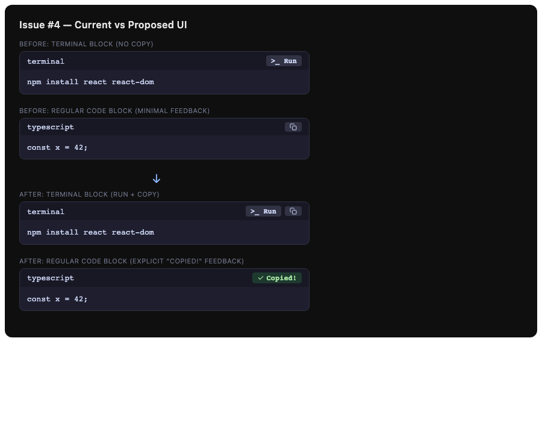
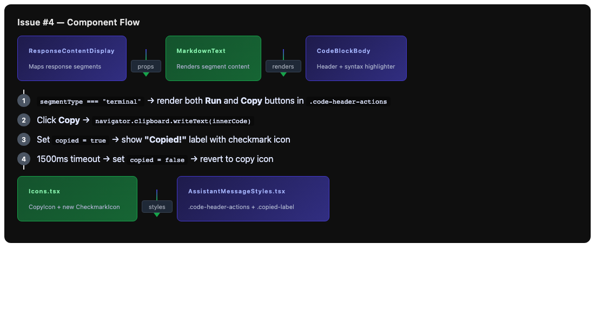

# Issue #4: Add a 'copy to clipboard' button next to assistant code blocks in chat messages

## Summary
Add copy-to-clipboard support to terminal code blocks and improve visual feedback for all copy actions in assistant chat message code blocks.

## Root Cause Analysis

**Current state:**
- Regular code blocks (`code_block` / `code` segments) render a copy button in the `.code-header` via `CodeBlockBody` in `MarkdownText.tsx`
- Terminal blocks (`terminal_command` / `terminal` segments) render only a "Run" button (`>_ Run`) with no way to copy the command text
- Copy feedback is minimal: a 300ms CSS `flash` animation that briefly adds a box-shadow to the button — users often miss this cue
- The `.code-header` uses `justify-content: space-between`, placing the language label on the left and a single action button on the right

**Desired state:**
- All code block types (regular + terminal) have a copy button
- Copy feedback is explicit: a "Copied!" text label appears for ~1.5 seconds, giving users clear confirmation

## Proposed Solution

1. **Add copy button to terminal blocks:** In `CodeBlockBody`, when `segmentType === "terminal"`, render both the "Run" button and a new "Copy" button side-by-side in the header.

2. **Improve copy feedback UX:** Replace the transient CSS flash animation with a React state-driven approach:
   - Track `copied` boolean state in `CodeBlockBody`
   - On copy success, show a "Copied!" label (with optional checkmark icon) for 1.5s
   - Use `setTimeout` to clear the state, with cleanup on unmount

3. **Style updates:**
   - Add `.code-header-actions` flex container for grouping multiple buttons
   - Add `.copied-label` styles for the feedback text
   - Keep existing `.code-block-button` styles, ensure buttons sit together with a small gap

## Files to Modify

| File | Change |
|------|--------|
| `src/renderer/Components/NewChatUI/AssistantMessage/MarkdownText.tsx` | Add copy button to terminal segments; replace flash animation with state-driven "Copied!" feedback; manage `copied` state with timeout |
| `src/renderer/Components/NewChatUI/AssistantMessage/AssistantMessageStyles.tsx` | Add `.code-header-actions` flex container styles; add `.copied-label` text styles; keep or remove `.flash` animation (backward compat) |
| `src/renderer/Components/Icons.tsx` | Add `CheckmarkIcon` SVG component for copy-success feedback |

## New Files

| File | Purpose |
|------|---------|
| `tests/renderer/MarkdownText.copy.test.tsx` | Unit tests for copy button behavior on regular and terminal code blocks |

## Implementation Steps

1. **Add CheckmarkIcon to `Icons.tsx`**
   - Create a small SVG checkmark icon (~12px) matching the existing `CopyIcon` stroke style

2. **Update `CodeBlockBody` in `MarkdownText.tsx`**
   - Import `CheckmarkIcon`
   - Add `copied` state: `const [copied, setCopied] = useState(false)`
   - Update `handleCopy` to set `copied = true` and start a 1500ms timeout that sets it back to `false`
   - In the header render:
     - For `terminal` segments: render a flex row with both the "Run" button and a "Copy" button
     - For `code` segments: keep single "Copy" button
     - When `copied` is true: show "Copied!" text (with checkmark icon) instead of the copy icon
   - Add `useEffect` cleanup for the timeout on unmount

3. **Update `AssistantMessageStyles.tsx`**
   - Add `.code-header-actions` class:
     ```css
     .code-header-actions {
       display: flex;
       align-items: center;
       gap: ${themeSpacing.xs};
     }
     ```
   - Add `.copied-label` class:
     ```css
     .copied-label {
       display: flex;
       align-items: center;
       gap: 4px;
       color: ${themeColors.unifiedUi.success};
       font-size: 0.85em;
       font-weight: ${themeTypography.fontWeight.semibold};
     }
     ```
   - Keep `.code-block-button.flash` for backward compatibility (no longer used but harmless)

4. **Write tests**
   - Test that regular code blocks show Copy button
   - Test that terminal blocks show both Run and Copy buttons
   - Test that clicking Copy triggers `navigator.clipboard.writeText` with correct content
   - Test that "Copied!" feedback appears for 1.5s after click
   - Test that timeout cleanup happens on unmount

## Test Strategy

- **Unit tests:** Focus on `CodeBlockBody` component in isolation:
  - Render with `segmentType="code"` → assert Copy button visible, no Run button
  - Render with `segmentType="terminal"` → assert both Run and Copy buttons visible
  - Simulate click on Copy → assert `navigator.clipboard.writeText` called with `innerCode`
  - Assert "Copied!" text appears immediately after click
  - Use Jest fake timers to assert "Copied!" disappears after 1500ms
  - Unmount during copied state → assert no setState-after-unmount warning

- **Edge cases:**
  - Empty `innerCode` — copy should still work (writes empty string)
  - Rapid double-click — should not queue multiple overlapping timeouts; use ref-guard or clear previous timeout
  - Clipboard API failure — `catch` block logs error, no crash; button returns to default state

## Risks & Mitigations

| Risk | Mitigation |
|------|------------|
| Clipboard API denied (e.g., in HTTP iframe) | `navigator.clipboard.writeText` is already wrapped in `.catch()`; no behavior change needed |
| Rapid clicks create overlapping timeouts | Clear existing timeout before setting a new one; store timeout ID in a ref |
| Visual regression in existing code blocks | Keep `.code-block-button` styles unchanged; only add new wrapper and label styles |
| `themeColors.unifiedUi.success` may not exist | Verify theme token exists; fallback to a hardcoded green if needed |

## Diagrams

### Current vs Proposed Code Block Header



### Component Flow



## Additional Context

- The existing copy functionality uses `navigator.clipboard.writeText()` with a CSS flash animation
- The `.code-header` flex layout already has `justify-content: space-between` making it straightforward to add a `.code-header-actions` wrapper on the right side
- `CodeBlockBody` is memoized (`CodeBlockBodyMemo`) so adding state requires ensuring the memo comparator (in `MarkdownText`) still works correctly — the `copied` state is internal to `CodeBlockBody` and does not need to be in props, so memo behavior is unaffected
