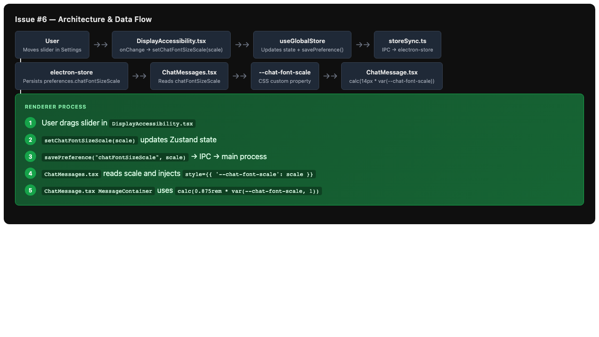
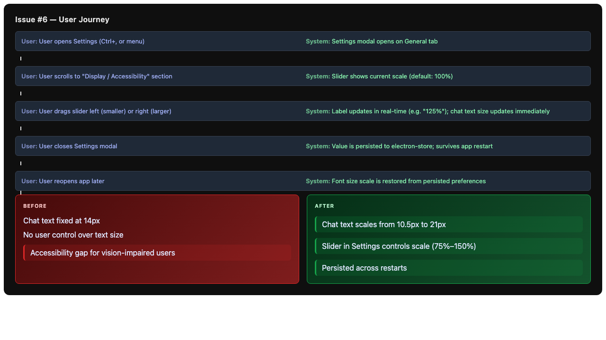

# Issue #6: Add font-size slider in Settings to scale chat message text

## Summary

Add a user-configurable font-size slider in the Settings panel (General tab) that scales the text size of chat messages. This improves accessibility and allows users to customize readability based on their screen size and vision preferences.

## Root Cause Analysis

This is a feature request, not a bug. The current state:
- Chat message text is hardcoded to `themeTypography.fontSize.sm` (14px equivalent) in `ChatMessage.tsx`
- No user-facing control exists to adjust text size for accessibility or personal preference
- Competing apps (Cursor, GitHub Copilot Chat, ChatGPT web) offer text size controls
- The `themeTypography` system uses static rem values with no dynamic scaling mechanism

The desired state:
- A global preference `chatFontSizeScale` (float, default `1.0`, range `0.75–1.5`)
- A slider UI in Settings → General → Display / Accessibility
- The scale applied dynamically via CSS custom property `--chat-font-scale`
- Value persisted across app restarts via electron-store

## Proposed Solution

1. **Schema & State**: Add `chatFontSizeScale` to `AppPreferences` in the store schema, global state, and initial defaults.
2. **Settings UI**: Create a new "Display / Accessibility" section in the General settings tab with a styled range slider labeled "Chat message text size" showing the current scale value.
3. **Persistence**: Wire the slider to `savePreference("chatFontSizeScale", value)` so changes survive app restarts.
4. **Font Scaling**: Inject `--chat-font-scale` as a CSS custom property on the chat messages container, and modify `ChatMessage.tsx`'s `MessageContainer` to scale its base font size using `calc(${themeTypography.fontSize.sm} * var(--chat-font-scale, 1))`.

## Files to Modify

| File | Change |
|------|--------|
| `src/main/store/store.schema.ts` | Add `chatFontSizeScale?: number` to `AppPreferences` interface; add default `chatFontSizeScale: 1.0` to `STORE_DEFAULTS.preferences` |
| `src/renderer/Stores/useGlobalStore.ts` | Add `chatFontSizeScale: number` to `GlobalState`; add `setChatFontSizeScale(scale)` to `GlobalActions`; hydrate from `initialPrefs`; add selector hooks `useChatFontSizeScale` / `useSetChatFontSizeScale` |
| `src/renderer/Components/Settings/Tabs/General/general.tsx` | Import and render `<DisplayAccessibility />` component |
| `src/renderer/Components/ChatMessage.tsx` | Update `MessageContainer` font-size to use `calc(${themeTypography.fontSize.sm} * var(--chat-font-scale, 1))` |
| `src/renderer/Components/NewChatUI/ChatMessagesContainer/ChatMessages.tsx` | Apply inline style with `--chat-font-scale` CSS custom property from global store |

## New Files

| File | Purpose |
|------|---------|
| `src/renderer/Components/Settings/Tabs/General/displayAccessibility.tsx` | Slider component for chat font size scale, reads/writes via global store hooks |

## Implementation Steps

1. **Update Store Schema** (`store.schema.ts`)
   - Add `chatFontSizeScale?: number` to `AppPreferences` interface
   - Add `chatFontSizeScale: 1.0` to `STORE_DEFAULTS.preferences`

2. **Update Global Store** (`useGlobalStore.ts`)
   - Add `chatFontSizeScale: number` to `GlobalState` interface
   - Add `setChatFontSizeScale: (scale: number) => void` to `GlobalActions` interface
   - Add to `defaultPreferenceSnapshot` in `getInitialPreferencesFromElectronStore()`
   - Hydrate from `initialPrefs.chatFontSizeScale` in store creation
   - Implement the setter action that calls `savePreference("chatFontSizeScale", scale)`
   - Export `useChatFontSizeScale` and `useSetChatFontSizeScale` selector hooks

3. **Create Settings Slider Component** (`displayAccessibility.tsx`)
   - Use the existing `Slider` styled component pattern from `D3CommunityGraph.tsx` as reference
   - Create styled slider in `settingsStyle.tsx` or inline in the component
   - Range: `0.75` to `1.5`, step `0.05`, default `1.0`
   - Show current value (e.g., "100%", "125%") next to the slider
   - Use `useChatFontSizeScale` and `useSetChatFontSizeScale` hooks
   - Wrap in `SettingContainer` with id `setting-display-accessibility`

4. **Wire into General Settings Tab** (`general.tsx`)
   - Import `DisplayAccessibility` and insert it after `ChatManagement`

5. **Apply Font Scaling in ChatMessage** (`ChatMessage.tsx`)
   - Change `MessageContainer` font-size from static `themeTypography.fontSize.sm` to `calc(${themeTypography.fontSize.sm} * var(--chat-font-scale, 1))`
   - Also scale `h1-h6` headings proportionally if desired (optional — can keep them em-based since they already scale relative to parent)

6. **Inject CSS Custom Property** (`ChatMessages.tsx`)
   - Read `chatFontSizeScale` from global store
   - Apply inline style `style={{ '--chat-font-scale': chatFontSizeScale }}` on the messages container wrapper

7. **Add Tests**
   - Add test for the new preference hook in existing store test files
   - Add test for the slider component rendering and interaction

## Test Strategy

- **Unit tests**:
  - `useGlobalStore`: verify `chatFontSizeScale` default is `1.0`, setter calls `savePreference` with correct key
  - `displayAccessibility.tsx`: verify slider renders with correct initial value, changing slider updates store, displays percentage label
  - `ChatMessage.tsx`: verify `--chat-font-scale` CSS custom property is consumed in `MessageContainer` font-size
- **Integration tests**:
  - End-to-end: open Settings → General, move slider, verify chat text size changes in real-time
- **Edge cases**:
  - Slider at minimum (`0.75`) and maximum (`1.5`) values
  - Store migration: old stores without `chatFontSizeScale` should default to `1.0`
  - Rapid slider changes: ensure debouncing or that sync is not excessively chatty
  - Accessibility: slider should be keyboard-navigable

## Risks & Mitigations

| Risk | Mitigation |
|------|------------|
| Slider changes cause excessive IPC/re-renders | The `savePreference` call is async and non-blocking; Zustand selectors minimize re-renders. No additional debouncing needed for a manual slider interaction. |
| CSS custom property not supported in older Electron/Chromium | Electron uses Chromium which has full CSS custom property support. No risk. |
| Font scaling breaks code block / syntax highlighter layout | Code blocks in `ChatMessage.tsx` use `em` and `rem` units that inherit from the message container. The scale is applied only to the base font size, so relative sizing is preserved. |
| Migration of existing user stores without the new field | The `??` (nullish coalescing) in `getInitialPreferencesFromElectronStore` defaults to `1.0`, ensuring backward compatibility. |
| Slider UI is inconsistent with existing settings toggles | Reuse the `SettingContainer`, `SettingTitle`, `SettingSection`, `SettingRow`, `SettingLabel` patterns from `settingsStyle.tsx`. The slider styled component can be modeled after the D3CommunityGraph slider but themed to match the settings panel. |

## Diagrams

### Architecture / Data Flow

### User Journey

