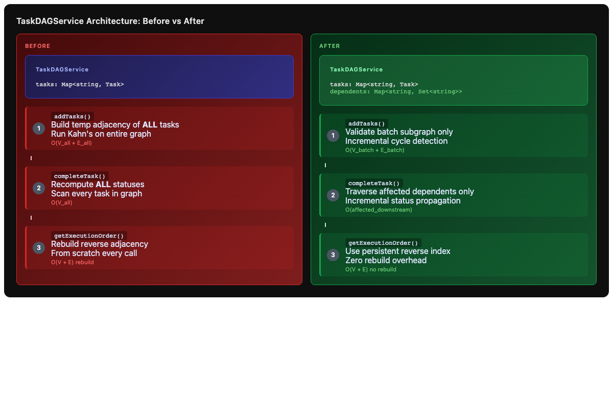
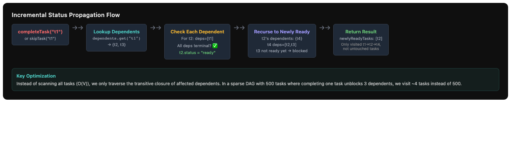

# Issue #7 – Optimize TaskDAGService Algorithmic Performance

## Summary

Replace full-graph traversals in `TaskDAGService` with incremental, index-driven algorithms. Add a persistent reverse-dependency (`dependents`) index so that `addTasks`, `completeTask`, `skipTask`, and `getExecutionOrder` only touch the data they actually need to change or read.

## Root Cause Analysis

The current `TaskDAGService` implementation has three algorithmic hotspots:

1. **Full-graph cycle detection in `addTasks`**: Every batch add builds a temporary adjacency map of all existing + new tasks and runs Kahn's algorithm over the entire graph. Since existing tasks were already validated, cycles can only form within the new batch or between new tasks and existing tasks via new→existing edges. This is **O(V_existing + V_new + E_all)** instead of **O(V_new + E_batch)**.

2. **Full-graph status recomputation**: `addTasks` calls `recomputeAllStatuses()` which iterates every task. Similarly, `completeTask`/`skipTask` call `recomputeAndFindNewlyReady()` which recomputes **all** statuses instead of only visiting affected dependents.

3. **No reverse-dependency index**: Every operation that needs to find dependents (cycle detection, status propagation, `getExecutionOrder`) rebuilds the reverse adjacency from scratch by scanning all tasks. This is **O(V + E)** every time.

## Proposed Solution

1. **Add a persistent `dependents: Map<string, Set<string>>` reverse-dependency index**, updated incrementally in `addTask`, `addTasks`, `rewireDependencies`, and cleared in `replaceTasks` / `restoreFromSnapshot`.

2. **Incremental cycle detection for `addTasks`**: Only validate the subgraph of new tasks + their inter-dependencies (O(batch_size + batch_edges) instead of O(all_tasks + all_edges)).

3. **Incremental status computation for `addTasks`**: Compute status for each new task directly from its dependencies' statuses instead of `recomputeAllStatuses()`.

4. **Incremental "newly ready" propagation for `completeTask`/`skipTask`**: Use the `dependents` index to only visit downstream tasks that could become ready, instead of recomputing all statuses.

5. **Faster `getExecutionOrder()`**: Use the persistent reverse index instead of rebuilding adjacency maps from scratch.

## Files to Modify

| File | Change |
|------|--------|
| `src/main/services/taskDAGService.ts` | Add `dependents` index; rewrite `addTasks`, `completeTask`, `skipTask`, `getExecutionOrder`, `rewireDependencies`, `replaceTasks`, `restoreFromSnapshot`, `addTask`, `hasCycle` for incremental operations |

## New Files

| File | Purpose |
|------|---------|
| `tests/services/taskDAGService.performance.test.ts` | Tests for incremental cycle detection, incremental status propagation, reverse index consistency, and performance smoke tests |

## Implementation Steps

1. **Add `dependents` index and helper methods**
   - Add `private dependents = new Map<string, Set<string>>()`
   - Add `private addDependent(depId: string, taskId: string)` — idempotent insert into the Set
   - Add `private removeDependent(depId: string, taskId: string)` — remove from the Set, clean up empty Sets
   - Add `private getDependents(taskId: string): Set<string>` — returns copy or empty set

2. **Update `addTask` to maintain the index**
   - After validating deps and creating the task, call `addDependent(depId, task.id)` for each dependency
   - Initialize `dependents.set(task.id, new Set())` so every task has an entry

3. **Rewrite `addTasks` for incremental cycle detection and status computation**
   - Keep the first pass (assign IDs, collect batchIds)
   - Replace full-graph `hasCycle(tempAdj)` with a batch-local Kahn's algorithm:
     - Build `batchAdj` from batch tasks only
     - Check in-degree counts within the batch
     - Also verify no batch task depends on another batch task in a cycle that references existing tasks
     - Since existing tasks never depend on new tasks, a cycle must be entirely within the batch
   - Remove `recomputeAllStatuses()` — compute each new task's status directly:
     - No deps → ready
     - All deps completed/skipped → ready
     - Otherwise → blocked
   - Add tasks to `this.tasks` and update `dependents` index for each

4. **Rewrite `completeTask` and `skipTask` for incremental propagation**
   - After marking the task terminal, collect newly ready tasks via BFS/DFS over dependents:
     - Start with the completed/skipped task's dependents
     - For each dependent, check if all its dependencies are now terminal
     - If yes and it was blocked/pending, mark it ready and add to newlyReady; enqueue its dependents
     - If it was already ready/in_progress, skip (don't re-enqueue)
   - Return `{ newlyReadyTasks }`

5. **Update `rewireDependencies` to maintain the index**
   - Before changing `task.dependencies`, remove old dependents entries
   - After changing, add new dependents entries
   - Incremental status recompute: start from the rewired task and propagate downstream (same BFS as completeTask)

6. **Update `replaceTasks` and `restoreFromSnapshot` to clear the index**
   - `this.dependents.clear()` before rebuilding

7. **Rewrite `getExecutionOrder` to use the persistent index**
   - Use `this.dependents` directly instead of rebuilding the adjacency map
   - Kahn's algorithm using `tasks` for in-degree and `dependents` for the forward graph

8. **Remove or simplify `recomputeAllStatuses` and `recomputeAndFindNewlyReady`**
   - `recomputeAllStatuses` is only needed by `restoreFromSnapshot` — keep it but make it private
   - `recomputeAndFindNewlyReady` is no longer needed — replace with the incremental BFS in `completeTask`/`skipTask`

9. **Write performance tests**
   - Test that reverse index stays consistent after addTasks, completeTask, skipTask, rewireDependencies, replaceTasks
   - Test incremental cycle detection with batch-only cycles
   - Test incremental status propagation: complete a task and verify only downstream tasks are evaluated
   - Test `getExecutionOrder` correctness is unchanged

## Test Strategy

- **Unit tests (existing)**: All 15 existing test files must pass without modification:
  - `tests/services/taskDAGService.test.ts`
  - `tests/services/taskDAGService.adversarial.test.ts`
  - `tests/services/taskDAGService.failedStatus.test.ts`
  - `tests/services/taskDAGService.mutations.adversarial.test.ts`
  - `tests/services/taskDAGService.mutations.test.ts`
  - `tests/services/taskDAGService.persistence.adversarial.test.ts`
  - `tests/services/taskDAGService.persistence.test.ts`
  - `tests/services/dagOrchestrator.test.ts`
  - `tests/stores/useDAGStore.test.ts`
  - `tests/stores/useDAGStore.1963-adversarial.test.ts`
  - `tests/stores/useDAGStore.adversarial.test.ts`
  - `tests/stores/useDAGStore.human-escalation.adversarial.test.ts`
  - `tests/stores/useDAGStore.human-escalation.test.ts`
  - `tests/stores/useDAGStore.session-scoping.test.ts`
  - `tests/lproc_tests/dagTools.test.ts`
  - `tests/lproc_tests/dagToolsIpcEvents.test.ts`

- **New tests** (`tests/services/taskDAGService.performance.test.ts`):
  - Reverse index consistency after every mutation type
  - Incremental cycle detection: cycles within batch detected, acyclic batches accepted
  - Incremental status propagation: verify `completeTask` only evaluates downstream tasks
  - `getExecutionOrder` returns identical results before/after optimization
  - Performance smoke test: create a 500-task DAG, measure that `addTasks`, `completeTask`, `skipTask`, and `getExecutionOrder` complete in < 50ms each

- **Edge cases**:
  - Task with no dependencies → ready
  - Task with all deps already terminal → ready
  - Task with mixed deps (some terminal, some not) → blocked
  - Completing a ready task that has no dependents → empty newlyReady
  - Skipping a blocked task with completed deps (should not happen via normal API, but verify invariant)
  - `rewireDependencies` that creates a new cycle → rejected, index unchanged
  - `replaceTasks` with in-progress task → rejected before clearing index
  - `restoreFromSnapshot` rebuilds index correctly

## Risks & Mitigations

| Risk | Mitigation |
|------|------------|
| `dependents` index gets out of sync with `tasks` map | Extensive unit tests for index consistency; every mutation has a single code path for index updates |
| Incremental cycle detection misses cross-batch cycles | Since existing tasks never depend on new tasks, cycles must be within the batch — document this invariant and test it |
| `newlyReadyTasks` ordering changes | Preserve existing ordering semantics (topological-ish); tests assert exact arrays |
| Performance regression in small DAGs | The new code paths have lower constant factors; smoke test on small DAGs to verify |
| `getExecutionOrder` behavior drift | Keep the same Kahn's algorithm, just use persistent index instead of rebuilt maps |

## Diagrams

### Architecture: Before vs After

### Incremental Status Propagation Flow

### Complexity Comparison

| Operation | Before | After |
|-----------|--------|-------|
| `addTasks` (batch) | O(V_all + E_all) | O(V_batch + E_batch) |
| `completeTask` | O(V_all) | O(affected_downstream) |
| `skipTask` | O(V_all) | O(affected_downstream) |
| `getExecutionOrder` | O(V + E) with rebuild | O(V + E) no rebuild |
| `rewireDependencies` | O(V_all + E_all) | O(affected_downstream) |
